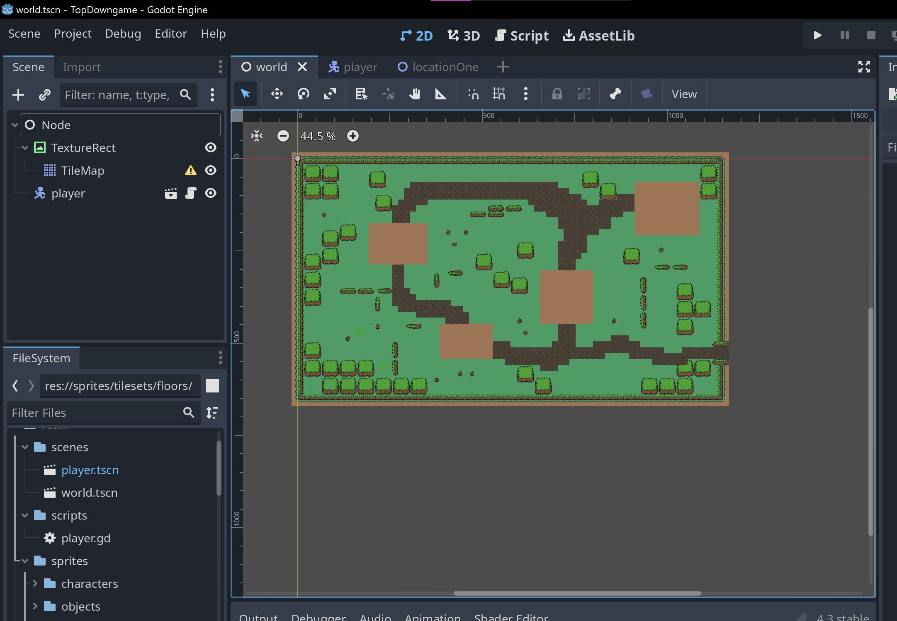

# Entry 1
##### 11/4/24

As of my first blog I've looked into making an rpg / top to down game. I've decided to use godot to create this game, while over the last month or 2 I've been watching videos on different methods and instances that godot can be used. I settle on a video that creates a top to down game. I've setup the terminal for godot as well as created sprites to use for the game. I've made a map layout for one of the scenes I picture to use. Godot allows you to use images on a grid to create your layout, allowing map creation to be really easy. (Basically drawing the map layout). Using godot allowed me to make scenes with minimal effort.

I've made directories and animated my sprite to create a more joyful feel to the game. I struggled with the animation originally due to the image being incompatible with the animation I wanted. Changing the scale and converting the sprite into a spritesheet fixed this.

I plan to work on more scenes and inputs that allow the character enter homes (stepping into a house changes the scene to an indoor environment), I also want to create a objective for the character but I still haven't decided whether or not I want to create an attack feature leading to a survival type game or if I want a peaceful adventure game.

The video - https://www.youtube.com/watch?v=5V9f3MT86M8

This video was one of several that helped me setup godot, its a step by step guide to create a game, I made tweaks and copied a few features that will better my game. The youtube channel has more videos that I used such as animation, map layout, and the godot ui. Overall I believe I will be able to manage godot fairly well with this youtube channel.

[Next](entry02.md)

[Home](../README.md)
