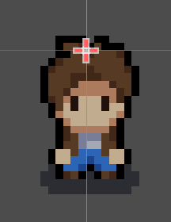

# Entry 5

##### 04/25/25

### Content:

This week, I focused on making my characters look more natural looking because I recently just updated the map again to fix minor errors and created an animation figure for the sprite from left to right. I did a decent job on creating a standing (idle) animation for my sprite character but I struggled ALOT with making collision detection because I completely blanked out and I don't even know how to get started.

One of the main challenges I had to go through this week was definitely updating my map because suddenly the image failed to load on my end even though I already imported it as a file....but it turns out I forgot to save it correctly as a jpg and it was just not that well working.

The second thing that I worked on was the adding standing animations to my character but it was really similar to my left and right animation of the sprite's movements so you can imagine me just drawing out these movements and putting them in a sprite sheet to later loop with Godot. One of the main issues that I encountered was the sprite freezing on whatever walking frame it was on.

In order for me to do this, I organized my `AnimatedSprite2D` node and separated all the idle frames from the walking frames in my sprite sheet. I made sure each idle animation only had a single frame, and used `animation_player.play("idle_direction")` when the movement input is zero. Setting up transitions between walk and idle took a bit of logic work, but it was worth it. It makes the game feel alive, even when the player is just standing still.

 
Here is one of the adjustments I did!! and the sprite sheet for the idling animation that I created:
Take a look at the picture below:

 

Alongside animation updates, I also began working on **collisions**, which is a huge step toward making the map playable. I added a `CollisionShape2D` to the player character and adjusted its size to match the bottom half of the sprite (the feet area) so collisions would feel accurate. Then, I started placing **StaticBody2D** nodes with collision shapes across the environment—like on trees, buildings, and walls—so the character can't walk through them.

### Sources:
Even though I skimmed through a lot of Youtube videos, the one listed below really helped me with the collision set up and how collisions works.

The notes document is just another reliable source that you can check out if you ever feel the need to start collisions or learn about them in your future project or game development.
- [Video of top-down collisions](https://www.youtube.com/watch?v=wxyz4567)

- [Godot Docs Using the TileMap and TileSet editors](https://docs.godotengine.org/en/stable/tutorials/2d/using_tilemaps.html)

### Engineering Design Process:
The EDP step that I'm currently focusing on is **Create a prototype**. I believe that I already figured out majority of what I needed and I just need collisions to work because then my game would be essentially completed and I get to create some coins for the user to collect, elevating the feeling of this game.

### Skills:
Some skills that were accumulated are listed below:  
- Being able to learn about animations and idling animations using sprite sheets and loops.

- Created animation logic to switch between movement and idle smoothly

- Applied `CollisionShape2D` to the player and tuned its size for a better feel

- Added `StaticBody2D` with collisions to world elements like buildings and trees (not 100% but I got a gist of it)

- Debugged and aligned issues for smoother interaction with the map image... (I don't even know how it got there okay...)

[Next](entry06.md)

[Home](../README.md)
