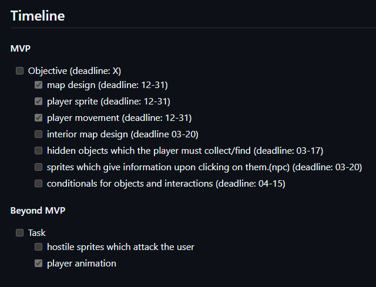

# Tool Learning Log

## Tool: **XGodot**

## Project: **Top to Down Game**

---

### 11/24/24:
* During the past week, I've been researching about my tool and followed youtube video guides to get me started. I followed the step by step guide to recreate the game in the video.

The video - https://www.youtube.com/watch?v=5V9f3MT86M8

### 3/16/25:
* During the last 4 months, I've created an mvp plan for what I want to achieve and have actually completed some of my tasks. I've made a character for the main user and created a map layout. I'm working on creating interactable environments for the player to experience entering houses or even new areas. Following that task, I plan to crean npc that provide dialogue to help the player find the hidden objective. The plan is listed below for specification. I do plan on updating my plan before the next or after the next learning log.

<!--
* Links you used today (websites, videos, etc)
* Things you tried, progress you made, etc
* Challenges, a-ha moments, etc
* Questions you still have
* What you're going to try next
-->
